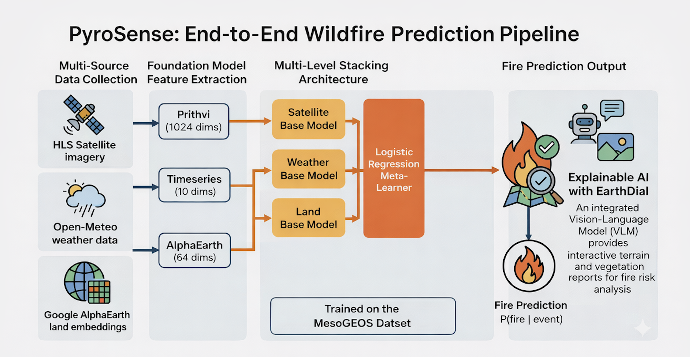

# PyroSense

[](https://www.python.org/downloads/)
[](https://opensource.org/licenses/MIT)

**Wildfire prediction using foundation models and multi-source feature fusion.**

PyroSense explores whether foundation models can improve wildfire prediction by combining satellite imagery embeddings from NASA's Prithvi model with weather data and Google's AlphaEarth embeddings.

## Pipeline



## Research Questions

1. **Can Prithvi embeddings provide predictive signal for fire risk?**
2. **Does multi-source fusion improve predictions over single-source models?**
3. **Can Vision-Language Models provide interpretable fire risk explanations?**

### Future Work

- Can finetuning foundation models like Prithvi improve fire prediction further?
- Does adding multi-temporal imagery (multiple dates per location) to Prithvi improve feature quality?
- Can this approach generalize to other regions beyond the Mediterranean?
- Can we integrate real-time satellite feeds for operational deployment?

## What We Built

- **Multi-Source Feature Fusion**: Combines 1024-dim Prithvi embeddings (NASA's Prithvi-EO-2.0-300M), weather data from Open-Meteo, and 64-dim AlphaEarth embeddings from Google Earth Engine
- **Stacking Ensemble**: Two-level architecture with source-specific base models and a meta-learner for optimal feature combination
- **EarthDial VLM Integration**: Vision-language model that generates human-readable fire risk reports with terrain and vegetation analysis

## Why This Approach?

### Benefits of Multi-Source Fusion

Traditional fire prediction systems often rely on a single data source. PyroSense combines **three complementary data types**:

| Data Source | What It Captures | Limitation Alone |
|-------------|------------------|------------------|
| **Satellite Imagery (Prithvi)** | Vegetation state, land cover, moisture | No temporal weather context |
| **Weather Data** | Temperature, humidity, wind, precipitation | No ground-level vegetation state |
| **AlphaEarth Embeddings** | Long-term land surface characteristics | Static, no seasonal variation |

By fusing these sources, we capture both **immediate conditions** (weather, current vegetation) and **structural factors** (terrain, land use patterns) that influence fire behavior.

### Practical Advantages

- **Robustness**: If one data source is unavailable or noisy, others compensate
- **Real-time Ready**: Weather and satellite data update frequently; the pipeline can run on fresh inputs
- **Scalable**: Feature extraction is parallelizable; inference is fast (<1 second per location)

### The Role of Vision-Language Models

Fire prediction alone isn't enough—emergency responders need **actionable insights**. EarthDial provides:

- **Terrain Analysis**: Identifies slopes, valleys, and features affecting fire spread
- **Vegetation Assessment**: Describes fuel types and density visible in imagery
- **Strategy Recommendations**: Suggests firefighting approaches based on visual analysis

This transforms a probability score into an **explainable report** that supports decision-making.

## Training Data

| Source | Description | Resolution | Purpose |
|--------|-------------|------------|---------|
| [Mesogeos](https://github.com/Orion-AI-Lab/mesogeos) | Mediterranean fire labels (2006-2022) | 1km daily | Fire/no-fire labels |
| [HLS](https://hls.gsfc.nasa.gov/) | Harmonized Landsat-Sentinel imagery | 30m | Satellite features |
| [Open-Meteo](https://open-meteo.com/) | Historical weather API | - | Weather features |
| [AlphaEarth](https://developers.google.com/earth-engine/datasets/catalog/GOOGLE_SATELLITE_EMBEDDING_V1_ANNUAL) | Land surface embeddings | ~10m | Terrain features |

**Training set**: 200 events (100 fire, 100 no-fire) from Greece, 2015-2021

## Results

| Model | Features | CV AUC (5-fold) |
|-------|----------|-----------------|
| Random Forest | Prithvi only | 0.950 |
| Random Forest | Weather only | 0.974 |
| Random Forest | AlphaEarth only | 0.783 |
| **Stacking Ensemble** | **All sources** | **0.984** |

**Key Findings:**

1. **Prithvi embeddings alone achieve strong performance** (0.95 AUC), validating foundation models for fire prediction
2. **Multi-source fusion improves accuracy** — the stacking ensemble outperforms any single source
3. **EarthDial successfully generates interpretable reports** with vegetation, terrain, and strategy analysis

## Getting Started

The easiest way to explore PyroSense is through the Jupyter notebook:

```bash
# Clone and install
git clone https://github.com/georgepap23/pyrosense.git
cd pyrosense
pip install -e .

# Run the notebook
jupyter notebook notebooks/01_prithvi_value_test.ipynb
```

The notebook walks through the complete pipeline: data loading, feature extraction, model training, and evaluation.

## Documentation

- [Installation & CLI Guide](docs/installation.md) - Installation and all CLI commands
- [Data Download Guide](docs/data_download.md) - How to obtain the datasets
- [Project Structure](docs/project_structure.md) - Codebase organization
- [Contributing](docs/CONTRIBUTING.md) - Development guidelines

## Quick Install

```bash
pip install -e .
```

See [Installation & CLI Guide](docs/installation.md) for Earth Engine, EarthDial setup, and CLI commands.

## Citation

```bibtex
@software{pyrosense2025,
  title = {PyroSense: Wildfire Prediction with Foundation Models},
  author = {Papakonstantinou, George},
  year = {2025},
  url = {https://github.com/georgepap23/pyrosense}
}
```

## Acknowledgments

- [Mesogeos Dataset](https://github.com/Orion-AI-Lab/mesogeos) - Orion AI Lab
- [Prithvi-EO-2.0](https://github.com/NASA-IMPACT/Prithvi-EO-2.0) - NASA IMPACT & IBM
- [AlphaEarth](https://developers.google.com/earth-engine) - Google
- [EarthDial](https://github.com/hiyamdebary/EarthDial) - Vision-Language Model

## License

MIT License - see [LICENSE](LICENSE) for details.
